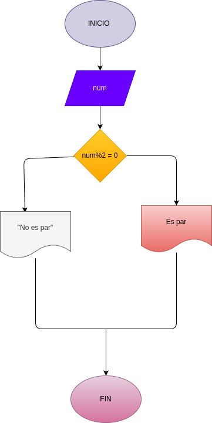

# Par_Impar
Programa para saber si es numero par o impar

# Analisis

## Imput

### Variables de entrada
num:digite un numero 
### procesing

num % 2==0

### output
 Par o impar
 # Diseño
 

### output
Par o impar 

# Diseño

# Construccion
